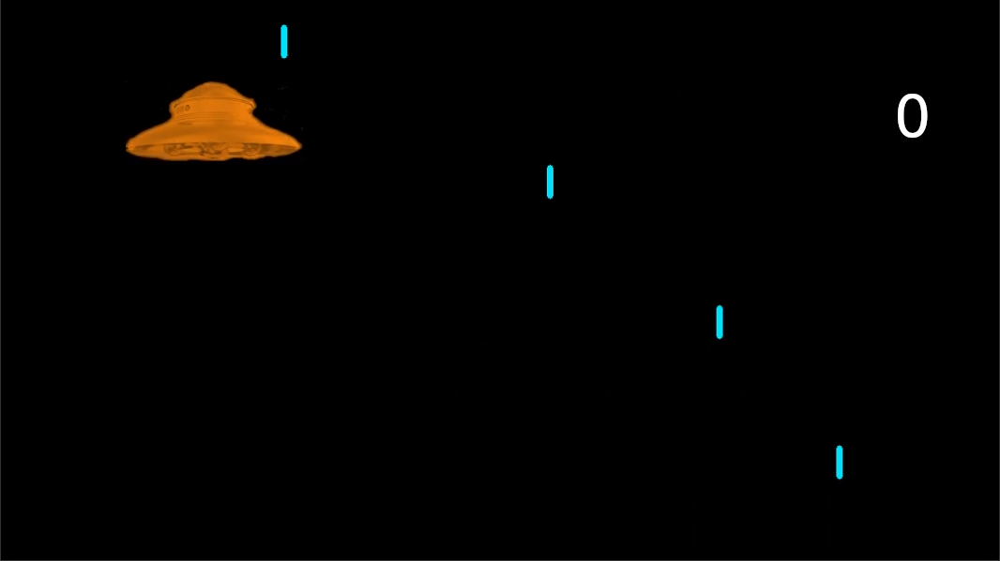
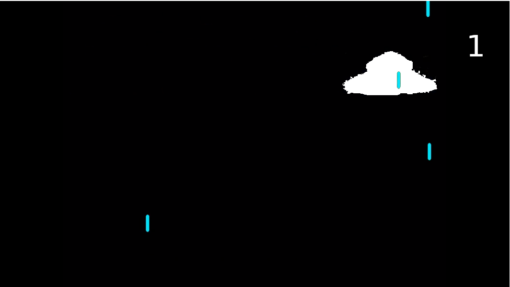
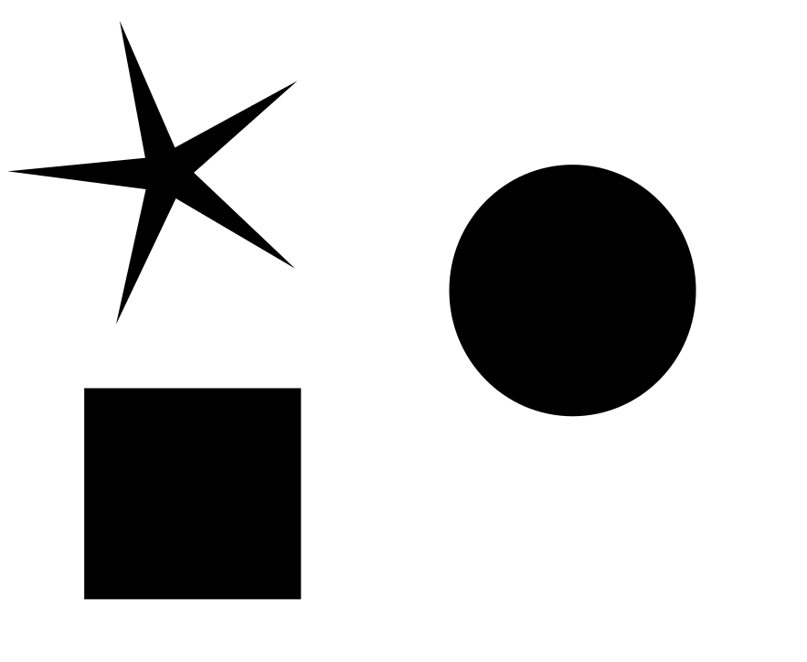
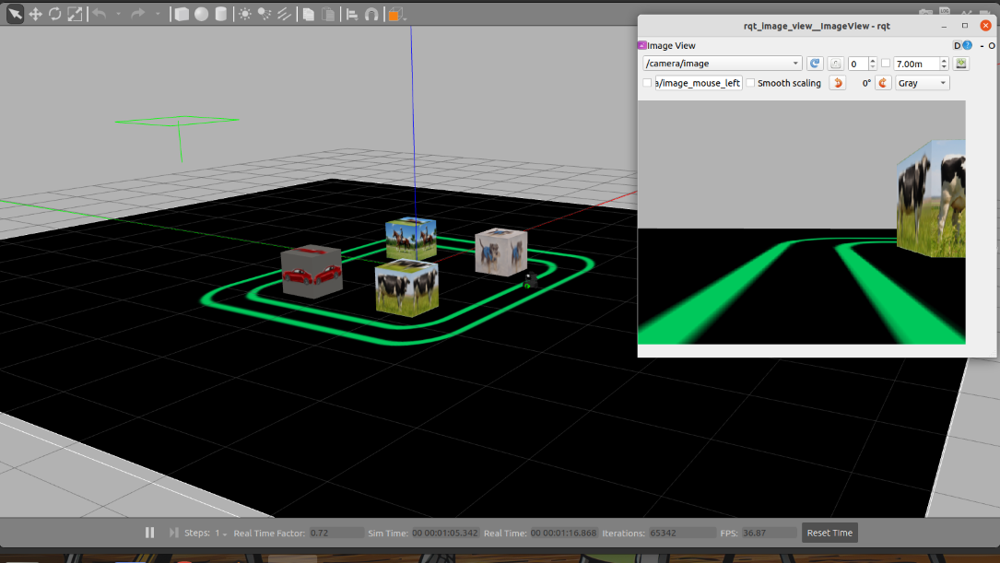

# Robótica Computacional 2022.1

## Simulado 2

### As questões deste simulado são da pova p2 do semestre passado. Aqui você deverá escolher duas questões das 4. No dia da prova você deverá escolher 3 de 4 questões. Vamos usar o Proctorio tanto neste simulado quanto na prova.**

Nome:_______________

Questões que fez:____________

**Observações de avaliações nesta disciplina:**

* Clone o repositório da prova dentro de `~/catkin_ws/src` se estiver trabalhando no Linux.
* Você poderá dar quantos `git push` quiser no repositório, apenas o último será considerado.
* Antes de finalizar a prova verifique que os arquivos enviados ao github estão na sua última versão. É sua responsabilidade garantir isso.
* Inicie a prova no Blackboard para a ferramenta de Proctoring iniciar.
* Só finalize a prova no Blackboard após enviar a prova via Github classroom.
* Durante esta prova vamos registrar somente a tela, não a câmera nem microfone
* Ponha o nome no enunciado da prova no Github
* Tenha os repositórios https://github.com/Insper/robot22.1/ ,  https://github.com/arnaldojr/my_simulation e https://github.com/arnaldojr/mybot_description.git  atualizados em seu `catkin_ws/src`.
* Você pode consultar a internet ou qualquer material, mas não pode se comunicar com pessoas ou colegas a respeito da prova
* Todos os códigos fornecidos adicionalmente aos scripts em que as questões serão desenvolvidas foram testados em outro contexto, e são apenas um compilado. Não é obrigatório usar. Fique à vontade para modificar esse código e strazer outros arquivos que achar melhor. 
* Teste sempre seu código
* Entregue código que executa - código com erro que impede de executar implica em zero na questào
* Faça commits e pushes frequentes no seu repositório (tem dicas [no final deste arquivo](./instrucoes_setup.md))
* Esteja conectado no Teams e pronto para receber calls do professor e da equipe. 
* Avisos importantes serão dados no chat da prova no Teams - deixe o Teams aberto.
* Permite-se consultar qualquer material online ou próprio. Não se pode compartilhar informações com colegas durante a prova.
* Faça commits frequentes. Em caso de disputa sobre plágio, o primeiro a enviar alguma ideia será considerado autor original.
* A responsabilidade por ter o *setup* funcionando é de cada estudante.
* Questões de esclarecimento geral podem ser perguntadas no chat do Teams.
* Se você estiver em casa pode fazer pausas e falar com seus familiares, mas não pode receber ajuda na prova.
* É proibido colaborar ou pedir ajuda a colegas ou qualquer pessoa que conheça os assuntos avaliados nesta prova.
* Os exercícios admitem diversas estratégias de resolução. A prova de cada aluno é única. Atenha-se apenas à rubrica de cada questão.
* Se precisar reiniciar para alternar entre Linux e seu sistema nativo reinicie o Proctoring e avise o professor via chat. 

Existe algumas dicas de referência rápida de setup [instrucoes_setup.md](instrucoes_setup.md)

**Integridade Intelectual**

Se você tiver alguma evidência de fraude cometida nesta prova, [use este serviço de e-mail anônimo](https://www.guerrillamail.com/pt/compose)  para informar ao professor através do e-mail `antoniohps1@insper.edu.br`.

# Questões

## Questão 1  (3.33 pontos)

Nesta questão você irá programar o score de um jogo de computador ao estilo Space Invaders. Uma nave alienígena tenta pousar na Terra, mas as baterias anti aéreas estão tentando eliminá-la.

Você deverá:
1. Identificar quando um tiro acerta a nave, e quando sai da mesma. A nave deve ser pintada de branco no tempo de duração em que é atingida pelo tiro.
1. Contar quantos tiros acertaram a nave, escrevendo na imagem 
1. Após 10 tiros acertarem a nave, ela deve ser pintada de cinza (RGB=128,128,128) pelo restante da sequência de video.

Você irá precisar do video [laserdefense.mp4](https://drive.google.com/file/d/1o5agy2PumsgwvePHK5_LA0c2oi7vTOvi/view?usp=sharing)

#### Exemplos de saída esperada

Nave ainda não atingida:

Nave sendo atingida pela primeira vez:

#### O que você deve fazer:

Você deverá trabalhar no arquivo `q1/q1.py`.

|Resultado| Conceito| 
|---|---|
| Não executa | zero |
| Segmenta ou filtra a imagem (nave e tiros) baseado em cores ou canais da imagem e produz output visual| 1.0|
| Identifica que um tiro acertou a nave | 1.8|
| Identifica que um tiro acertou a nave e saiu da mesma | 2.1 |
| Identifica as três situações pedidas no enunciado, mas não está perfeito | 2.8 |
| Resultados perfeitos | 3.33|

Casos intermediários ou omissos da rubrica serão decididos pelo professor.

## Questão 2  (3.33 pontos)

### O que é para fazer

Um código que plota **na tela** sob as imagem das figuras geométricas, seus respectivos nomes: `estrela`, `quadrado` ou `circulo`.

Para diferenciar as retas, comente o código qual foi o critério usado para identificar as formas.

#### Orientações

O código base para este exercício está em `q2/q2.py`. Trabalhe na função `encontra_figuras()`. Este exercício **não precisa** de ROS.

|Resultado| Conceito| 
|---|---|
| Não executa | 0 |
| Segmenta as regiões escuras | 0.7 |
| identifica as figuras com critério puramente empírica (tentativa e erro de tamanho)     | 1.0 |
| Identifica corretamente apenas uma figura com uma base teórica, que funciona independentemente das dimensões, posições e orientações das figuras  | 2.3 |
| Encontra as trêS figuras de forma bem fundamentada | 3.3 | 

Casos intermediários ou omissos da rubrica serão decididos pelo professor.

## Questões de ROS

**Atenção: ** 

Para fazer estra questão você precisa ter o `my_simulation` e o `mybot_description` atualizado.

    cd ~/catkin_ws/src
    cd my_simulation
    git stash
    git pull

Ou então se ainda não tiver:

    cd ~/catkin_ws/src
    git clone https://github.com/arnaldojr/my_simulation.git

Para o mybot_description:

    cd ~/catkin_ws/src
    cd mybot_description
    git stash
    git pull

Ou então se ainda não tiver:

    cd ~/catkin_ws/src
    git clone https://github.com/arnaldojr/mybot_description

Em seguida faça o [catkin_make](./instrucoes_setup.md). 

## Questão 3 (3.33 pontos)

No cenário representado abaixo, você deverá fazer o robô derrubar os creepers amarelos, em ordem crescente de ID Aruco.
Para derrubar o creeper, o robô deverá parar a 30 cm do mesmo, eriçar a garra e avaçar sobr o creeper até derrubá-lo.
Após derrubar o primeiro creeper, o robô deverá voltar à posição inicial usando a odometria.

#### O que é para fazer

Você deverá trabalhar no arquivo `sim2/scripts/q3.py`. Se quiser pode modificar os arquivos auxiliares, porém os mesmoms devem ser commitados junto com o arquivo da questão. 

#### Detalhes de como rodar

Para subir o cenário:

    roslaunch my_simulation reuniao.launch
    roslaunch mybot_description mybot_control2.launch

Para rodar o programa, você pode:
1. Abrir o VSCode na pasta do aqruivo e dar o `play`
2. Executar o comando do ROS: `rosrun sim2_221 q3.py`

|Resultado| Conceito| 
|---|---|
| Não executa | 0 |
| Faz o robô detectar a cor amarela e os Arucos | 1.0 |
| Derruba um creeper  | 1.5 |
| Derruba um creeper e volta | 2.0 |
| Derruba os creeper mas fora de ordem | 2.5|
| Faz o que foi pedido | 3.3|

Casos intermediários ou omissos da rubrica serão decididos pelo professor.

## Questão 4 (3.33 pontos)

Aqui você deverá executar o cenário abaixo. O robô deverá dar uma volta inteira dentro da pista e depois parar a 30 cm do cubo com a figura designada de acordo com o primeiro nome do aluno:

- A a E:  cachorro
- F a J: cavalo
- K a R: carro
- S a Z: vaca

#### O que é para fazer

Você deverá trabalhar no arquivo `sim2/scripts/q4.py`. Se quiser pode modificar os arquivos auxiliares, porém os mesmoms devem ser commitados junto com o arquivo da questão. 

#### Detalhes de como rodar

Para subir o cenário:

    roslaunch my_simulation quadra.launch

Para rodar o programa, você pode:
1. Abrir o VSCode na pasta do aqruivo e dar o `play`
2. Executar o comando do ROS: `rosrun sim2_221 q4.py`

|Resultado| Conceito| 
|---|---|
| Não executa | 0 |
| Demonstra indentificação de objeto e segmentação por cor, com output visual | 0.6 |
| Faz o robô chegar ao cubo apenas | 1.0 |
| Consegue dar a volta completa | 1.50|
| Chega ao cubo e usa a pista, porém a volta não e completa| 2.50|
| Cumpre a tarefa perfeitamente | 3.33|

Casos intermediários ou omissos da rubrica serão decididos pelo professor.

**Boa sorte!!**